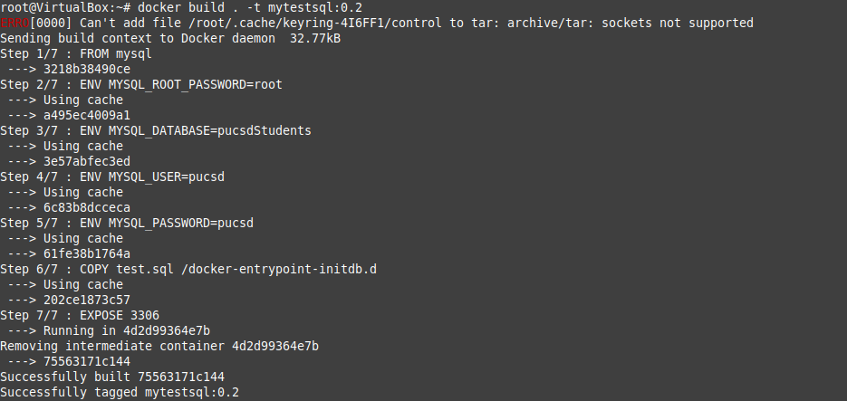

# Devops_docker_sql_assignment
The Dockerfile and sql file for the 2nd assignment of Devops  

## What to do
1. Create a Dockerfile and test.sql file
2. Add the code as required in them, I have also uploaded mine. You can use them as reference
3. Then in the terminal give the following commands
```
docker build . -t mytestsql:0.1
docker run -itd mytestsql:0.1
docker exec -it <your container id which you can get by giving command docker ps> bash
mysql -upucsd -p
use pucsdStudents
select * from studentData
```



